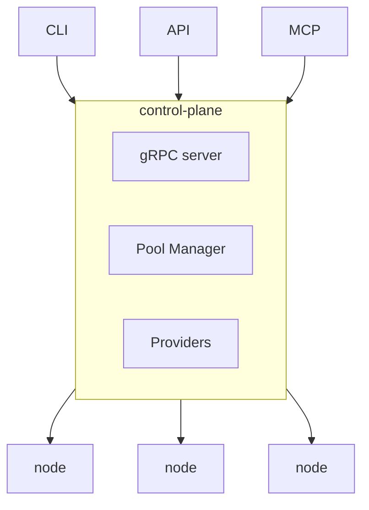

# Navarch

Navarch provisions and maintains GPU instances across cloud providers.

Navarch abstracts away the complexity of provisioning and maintaining GPU instances across cloud providers. You bring your cloud credentials and request capacity. Navarch provisions nodes, monitors hardware health, and automatically replaces failures—so you can focus on what runs on the GPUs, not the GPUs themselves.

## Why Navarch?

Managing GPU fleets across clouds is painful:

- **Every cloud is different.** GCP, AWS, Azure, Lambda Labs—each has its own API, instance types, and spot/preemption behavior. You end up writing glue code instead of training models.

- **"Running" doesn't mean "healthy."** Cloud providers tell you a VM is up. They don't tell you about XID errors, NVLink degradation, or thermal throttling that silently corrupt your gradients or tank your throughput.

- **Manual replacement doesn't scale.** When a node goes bad at 3am in a 256-GPU cluster, someone has to wake up, identify it, drain it, and provision a replacement. This should be automatic.

Navarch treats GPUs as a single pool of fungible compute across all your cloud accounts. Request capacity, get healthy GPUs, and let Navarch handle the operational toil.

## How It Works



**CLI / API / MCP** are different ways to interact with Navarch. They all talk to the same control plane over gRPC.

**control-plane** manages cloud provider APIs, tracks fleet state, and makes provisioning decisions.

**node** is a lightweight daemon that runs on each GPU instance. It monitors hardware health via NVML, reports metrics, and cordons itself when health checks fail.

## Repository Structure

```
navarch/
├── cmd/
│   ├── navarch/          # CLI
│   ├── control-plane/    # Control plane server
│   ├── node/             # Node daemon
│   └── simulator/        # Fleet simulator
├── pkg/
│   ├── config/           # Configuration loading
│   ├── controlplane/     # Control plane logic
│   ├── gpu/              # GPU detection and health checks
│   ├── node/             # Node daemon logic
│   ├── pool/             # Pool management and autoscaling
│   ├── provider/         # Cloud provider implementations
│   │   ├── lambda/
│   │   ├── gcp/
│   │   ├── aws/
│   │   └── fake/
│   └── simulator/        # Fleet simulation framework
├── proto/                # Protobuf definitions
├── scenarios/            # Simulation scenario files
├── docs/
└── examples/
```

## Quick Start

```bash
# Install the CLI and control plane
curl -sSL https://navarch.dev/install.sh | sh
# or: go install github.com/navarch-dev/navarch@latest

# Configure cloud credentials
navarch config set-credentials gcp --project my-project --key-file ~/sa.json
navarch config set-credentials aws --profile my-profile

# Start the control plane (runs locally or on a server)
navarch serve

# Request GPUs
navarch up --gpus 8 --type h100 --name my-cluster

# Check fleet status
navarch status

# SSH into a node
navarch ssh my-cluster-0

# Tear down
navarch down my-cluster
```

The control plane manages provisioning and fleet state. When Navarch provisions a GPU instance, it automatically installs the node daemon via cloud-init—you don't need to install anything on the nodes manually.

## Development

Use the fleet simulator to test Navarch locally without provisioning cloud resources:

```bash
# Build the simulator
make build

# Run a GPU failure scenario
./bin/simulator run scenarios/gpu-failure.yaml -v

# Or start an interactive session
./bin/simulator interactive -v
```

The simulator creates an embedded control plane and simulated nodes. You can inject failures, issue commands, and observe system behavior. See [docs/simulator.md](docs/simulator.md) for details.

## What Navarch Does

- **Multi-cloud provisioning**: Unified API across GCP, AWS, Azure, Lambda Labs, and more
- **Health monitoring**: Three-tier GPU health system:
  - *Boot checks*: Fast validation on startup (`nvidia-smi`, basic GPU read/write)
  - *Passive monitoring*: Continuous non-invasive checks (XID errors via `dmesg`, ECC errors, thermals via DCGM)
  - *Active diagnostics*: Periodic deep checks (`dcgmi diag`, GPU burn tests) that require exclusive GPU access
- **Automatic replacement**: Bad nodes are cordoned and replaced without manual intervention
- **Extensible scheduling**: Pluggable interface for custom provisioning logic (cost optimization, region preferences, etc.)

## What Navarch Doesn't Do

- **Workload scheduling**: Navarch gives you GPUs. What you run on them (PyTorch, JAX, vLLM) is up to you.
- **Training orchestration**: Use your preferred framework. Navarch ensures the underlying nodes stay healthy.
- **Storage management**: Bring your own storage solution.

## Extending Navarch

Navarch is designed to be extended via interfaces.

### Extension Points

| Extension | Interface | Example use case |
|-----------|-----------|------------------|
| **Cloud Provider** | `provider.Provider` | Add support for Azure, CoreWeave, bare metal |
| **Autoscaler** | `pool.Autoscaler` | Custom scaling logic, ML-based prediction |

### Interfaces

```go
// Provider abstracts cloud-specific provisioning operations.
type Provider interface {
    Name() string
    Provision(ctx context.Context, req ProvisionRequest) (*Node, error)
    Terminate(ctx context.Context, nodeID string) error
    List(ctx context.Context) ([]*Node, error)
}

// Autoscaler decides how many nodes a pool should have.
type Autoscaler interface {
    Recommend(ctx context.Context, state PoolState) (ScaleRecommendation, error)
}
```

### Built-in Implementations

- **Providers**: Lambda Labs, GCP, AWS, Fake (for testing)
- **Autoscalers**: Reactive, Queue-based, Scheduled, Predictive, Composite

## Roadmap

- [x] Multi-cloud provisioning (Lambda Labs, GCP, AWS)
- [x] Node daemon with NVML monitoring and XID error detection
- [x] Pool management with pluggable autoscaling
- [x] Multi-provider pools (fungible compute)
- [ ] Spot instance support with preemption handling
- [ ] Active diagnostics (`dcgmi diag`, GPU burn tests)
- [ ] Topology-aware provisioning
- [ ] Web dashboard

## License

Apache 2.0