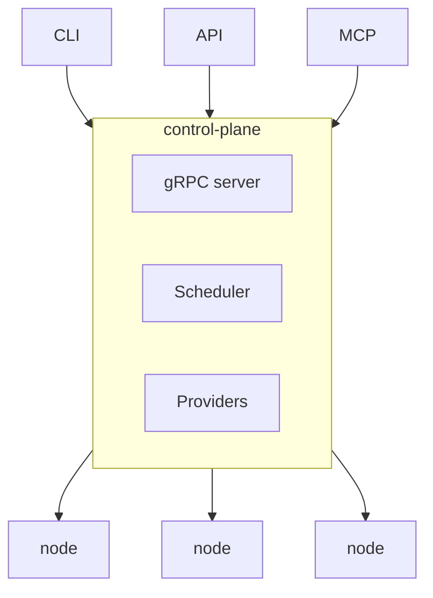

# Navarch

Navarch provisions and maintains GPU instances across cloud providers.

Navarch abstracts away the complexity of provisioning and maintaining GPU instances across cloud providers. You bring your cloud credentials and request capacity. Navarch provisions nodes, monitors hardware health, and automatically replaces failures—so you can focus on what runs on the GPUs, not the GPUs themselves.

## Why Navarch?

Managing GPU fleets across clouds is painful:

- **Every cloud is different.** GCP, AWS, Azure, Lambda Labs—each has its own API, instance types, and spot/preemption behavior. You end up writing glue code instead of training models.

- **"Running" doesn't mean "healthy."** Cloud providers tell you a VM is up. They don't tell you about XID errors, NVLink degradation, or thermal throttling that silently corrupt your gradients or tank your throughput.

- **Manual replacement doesn't scale.** When a node goes bad at 3am in a 256-GPU cluster, someone has to wake up, identify it, drain it, and provision a replacement. This should be automatic.

Navarch treats GPUs as a single pool of fungible compute across all your cloud accounts. Request capacity, get healthy GPUs, and let Navarch handle the operational toil.

## How It Works



**CLI / API / MCP** are different ways to interact with Navarch. They all talk to the same control plane over gRPC.

**control-plane** manages cloud provider APIs, tracks fleet state, and makes provisioning decisions.

**node** is a lightweight daemon that runs on each GPU instance. It monitors hardware health via NVML, reports metrics, and cordons itself when health checks fail.

## Repository Structure

```
navarch/
├── cmd/
│   ├── navarch/          # CLI entrypoint
│   ├── control-plane/    # Control plane server
│   └── node/             # Node daemon
├── pkg/
│   ├── api/              # gRPC service definitions
│   ├── provider/         # Cloud provider implementations
│   │   ├── provider.go   # Provider interface
│   │   ├── gcp/
│   │   └── aws/
│   ├── scheduler/        # Scheduling logic
│   │   ├── scheduler.go  # Scheduler interface
│   │   └── first.go      # FirstAvailable implementation
│   ├── health/           # Health check implementations
│   │   ├── health.go     # HealthCheck interface
│   │   ├── nvml.go
│   │   ├── xid.go
│   │   └── boot.go
│   ├── remediate/        # Remediation logic
│   │   ├── remediate.go  # Remediator interface
│   │   └── cordon.go
│   └── notify/           # Notification implementations
│       ├── notify.go     # Notifier interface
│       └── log.go
├── proto/                # Protobuf definitions
│   └── navarch.proto
├── docs/
│   └── extending.md
└── examples/
    ├── custom-provider/
    └── cost-scheduler/
```

## Quick Start

```bash
# Install the CLI and control plane
curl -sSL https://navarch.dev/install.sh | sh
# or: go install github.com/navarch-dev/navarch@latest

# Configure cloud credentials
navarch config set-credentials gcp --project my-project --key-file ~/sa.json
navarch config set-credentials aws --profile my-profile

# Start the control plane (runs locally or on a server)
navarch serve

# Request GPUs
navarch up --gpus 8 --type h100 --name my-cluster

# Check fleet status
navarch status

# SSH into a node
navarch ssh my-cluster-0

# Tear down
navarch down my-cluster
```

The control plane manages provisioning and fleet state. When Navarch provisions a GPU instance, it automatically installs the node daemon via cloud-init—you don't need to install anything on the nodes manually.

## What Navarch Does

- **Multi-cloud provisioning**: Unified API across GCP, AWS, Azure, Lambda Labs, and more
- **Health monitoring**: Three-tier GPU health system:
  - *Boot checks*: Fast validation on startup (`nvidia-smi`, basic GPU read/write)
  - *Passive monitoring*: Continuous non-invasive checks (XID errors via `dmesg`, ECC errors, thermals via DCGM)
  - *Active diagnostics*: Periodic deep checks (`dcgmi diag`, GPU burn tests) that require exclusive GPU access
- **Automatic replacement**: Bad nodes are cordoned and replaced without manual intervention
- **Extensible scheduling**: Pluggable interface for custom provisioning logic (cost optimization, region preferences, etc.)

## What Navarch Doesn't Do

- **Workload scheduling**: Navarch gives you GPUs. What you run on them (PyTorch, JAX, vLLM) is up to you.
- **Training orchestration**: Use your preferred framework. Navarch ensures the underlying nodes stay healthy.
- **Storage management**: Bring your own storage solution.

## Extending Navarch

Navarch is designed to be extended. The core handles provisioning and basic health monitoring; you can plug in custom logic for everything else.

### Extension Points

| Extension | Interface | Example use case |
|-----------|-----------|------------------|
| **Cloud Adapter** | `Provider` | Add support for Azure, CoreWeave, bare metal |
| **Scheduler** | `Scheduler` | Cost optimization, region preferences, carbon-aware scheduling |
| **Health Check** | `HealthCheck` | Custom diagnostics, fabric validation, workload-specific checks |
| **Remediation** | `Remediator` | Custom recovery (reset GPU vs. replace node vs. alert-only) |
| **Notifier** | `Notifier` | PagerDuty, Slack, custom alerting pipelines |

### Interfaces

```go
// Provider abstracts cloud-specific provisioning operations.
type Provider interface {
    Name() string
    Provision(ctx context.Context, req ProvisionRequest) (*Node, error)
    Terminate(ctx context.Context, nodeID string) error
    List(ctx context.Context) ([]*Node, error)
}

// Scheduler scores provisioning options. Higher scores are preferred.
type Scheduler interface {
    Score(ctx context.Context, option ProvisionOption) (float64, error)
}

// HealthCheck runs a diagnostic and returns node health status.
type HealthCheck interface {
    Name() string
    Run(ctx context.Context, node *Node) (*HealthResult, error)
    // Interval returns how often this check should run.
    // Return 0 for boot-only checks.
    Interval() time.Duration
}

// Remediator decides what to do with an unhealthy node.
type Remediator interface {
    Remediate(ctx context.Context, node *Node, result *HealthResult) (Action, error)
}

// Notifier sends alerts when notable events occur.
type Notifier interface {
    Notify(ctx context.Context, event Event) error
}
```

### Built-in Implementations

Navarch ships with default implementations:

- **Providers**: GCP, AWS (more coming)
- **Scheduler**: `FirstAvailable` (no preference) 
- **Health Checks**: `NvmlCheck` (temperatures, ECC errors), `XidCheck` (dmesg parsing), `BootCheck` (basic GPU read/write)
- **Remediator**: `CordonAndReplace` (marks node unhealthy, provisions replacement)
- **Notifier**: `LogNotifier` (writes to stdout)

To use custom implementations, register them with the control plane:

```go
cp := navarch.NewControlPlane(
    navarch.WithProvider(myBareMetalProvider),
    navarch.WithScheduler(myCostAwareScheduler),
    navarch.WithHealthCheck(myFabricValidator),
    navarch.WithNotifier(myPagerDutyNotifier),
)
```

See [docs/extending.md](docs/extending.md) for detailed examples.

## Roadmap

- [x] Basic multi-cloud provisioning (GCP, AWS)
- [x] Node daemon with boot checks and passive NVML monitoring
- [ ] XID error detection and classification
- [ ] Automatic node replacement
- [ ] Spot instance support with preemption handling
- [ ] Active diagnostics (weekly `dcgmi diag`, GPU burn tests)
- [ ] Topology-aware provisioning (same rack, same switch)
- [ ] Fabric validation (NVLink/InfiniBand bandwidth via `nvbandwidth`, NCCL all-reduce)
- [ ] Web dashboard

## License

Apache 2.0