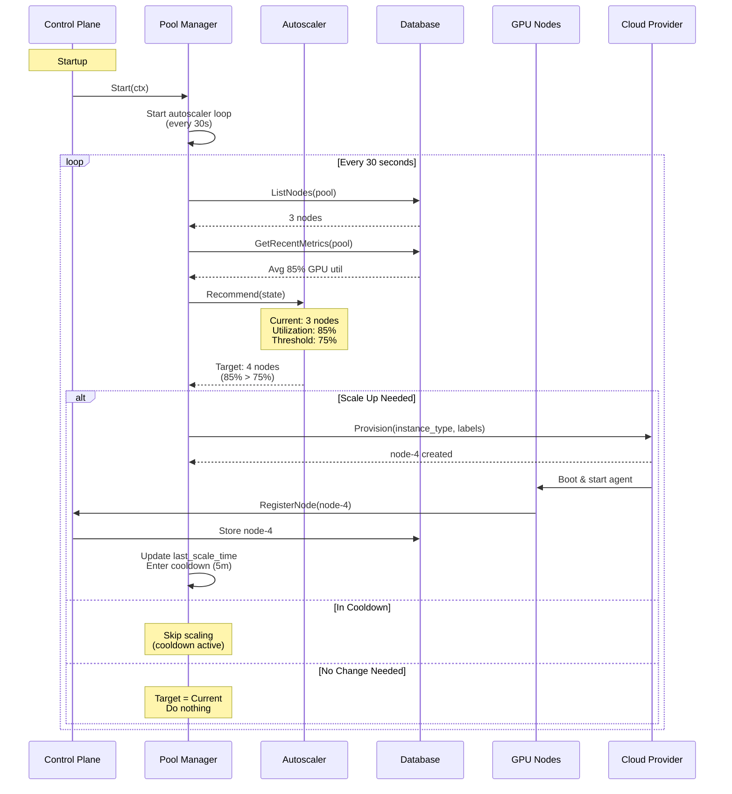
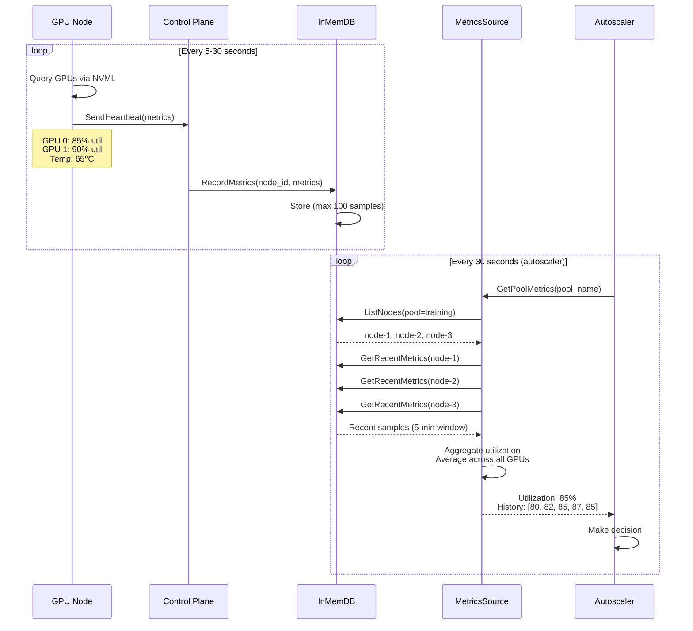

# Architecture

Navarch is an infrastructure management layer that sits between cloud provider APIs and workload schedulers.

## System layers

```
┌────────────────────────────────────────────┐
│ Workload Schedulers                        │
│ (Kubernetes, Slurm, Ray, custom)           │  Schedule jobs onto nodes
└────────────────────────────────────────────┘
                    ↓
┌────────────────────────────────────────────┐
│ Navarch Control Plane                      │
│ - Provisions GPU VMs                       │  Manage infrastructure
│ - Monitors hardware health                 │
│ - Autoscales node pools                    │
│ - Auto-replaces failures                   │
└────────────────────────────────────────────┘
                    ↓
┌────────────────────────────────────────────┐
│ Cloud Provider APIs                        │
│ (Lambda Labs, GCP, AWS, Azure)             │  Raw compute
└────────────────────────────────────────────┘
```

## Components

### Control plane

The control plane is a single gRPC server that:
- Accepts node registrations and heartbeats
- Stores node state and metrics in an in-memory database
- Manages multiple node pools with independent autoscaling policies
- Issues commands to nodes (cordon, drain, terminate)
- Tracks instance lifecycle from provisioning through termination

### Instance manager

The instance manager tracks cloud instances separately from nodes:

- Creates instance records when provisioning starts
- Updates state when nodes register successfully
- Detects stale instances (provisioned but never registered)
- Cleans up old terminated instance records

This provides visibility into the gap between provisioning and registration, catching failures like:
- Boot failures before agent starts
- Network issues preventing registration
- Agent crashes during startup

### Node agent

Each GPU instance runs a lightweight agent that:
- Registers with the control plane on startup
- Sends heartbeats with GPU metrics every 5-30s
- Runs health checks (boot, NVML, XID detection)
- Polls for and executes commands from the control plane

### Pool manager

The pool manager orchestrates autoscaling:
- Evaluates autoscaler recommendations every 30s (configurable)
- Provisions new nodes when scaling up
- Terminates nodes when scaling down
- Respects cooldown periods to prevent oscillation

### Metrics collection

Nodes report GPU metrics in heartbeats:
- GPU utilization percentage (0-100)
- Temperature, power usage, memory usage
- XID errors and health status

The control plane aggregates metrics by pool for autoscaling decisions.

## Relationship with Kubernetes

Navarch and Kubernetes operate at different layers and can work together or independently.

### What Kubernetes does

**Kubernetes manages workloads:**
- Schedules pods onto existing nodes
- Scales pod replicas based on CPU/memory/custom metrics
- Restarts failed containers
- Handles service discovery and load balancing

**Kubernetes Cluster Autoscaler:**
- Adds nodes when pods cannot be scheduled (pending state)
- Removes nodes when they are underutilized
- One implementation per cloud provider

### What Navarch does

**Navarch manages infrastructure:**
- Provisions GPU VMs across multiple clouds
- Monitors GPU hardware health (XID errors, thermal issues)
- Auto-replaces nodes with failed GPUs
- Scales based on GPU utilization or job queue depth

### Integration patterns

#### Pattern 1: Kubernetes without Navarch

Traditional approach:

```bash
# Manually provision VMs with GPUs
gcloud compute instances create gpu-node-1 --accelerator=...

# Install Kubernetes
kubeadm init...

# Deploy Cluster Autoscaler
kubectl apply -f cluster-autoscaler.yaml
```

**Limitations:**
- Cloud-specific setup for each provider
- No GPU health monitoring
- Manual intervention for hardware failures
- No multi-cloud support

#### Pattern 2: Navarch + Kubernetes

Recommended for production:

```yaml
# config.yaml - Navarch handles infrastructure
pools:
  k8s-workers:
    providers:
      - name: lambda
        priority: 1
      - name: gcp
        priority: 2
    min_nodes: 2
    max_nodes: 50
    autoscaling:
      type: reactive
      scale_up_at: 80  # GPU utilization
      scale_down_at: 20
    health:
      auto_replace: true
```

Then install Kubernetes on Navarch-provisioned nodes. Kubernetes schedules workloads, Navarch maintains healthy infrastructure.

**Benefits:**
- Multi-cloud with automatic failover
- GPU health monitoring and auto-replacement
- Unified infrastructure management
- Kubernetes focuses on workload orchestration

#### Pattern 3: Disable Navarch autoscaling

Use Kubernetes Cluster Autoscaler for scaling:

```yaml
pools:
  k8s-workers:
    min_nodes: 0
    max_nodes: 100
    # No autoscaling - let K8s Cluster Autoscaler control it
    health:
      auto_replace: true  # Keep health monitoring
```

Navarch provisions nodes and replaces failures, Kubernetes handles scaling decisions.

#### Pattern 4: Navarch without Kubernetes

Use Navarch with custom schedulers, Slurm, or direct SSH:

```yaml
pools:
  training:
    min_nodes: 5
    max_nodes: 100
    autoscaling:
      type: queue
      jobs_per_node: 10  # External scheduler reports queue depth
```

Your scheduler reports job queue metrics to Navarch via the `MetricsSource` interface.

## Autoscaling decision signals

Navarch supports multiple signals for autoscaling:

### GPU utilization

Reported by nodes in heartbeats. Aggregated across all GPUs in the pool.

```yaml
autoscaling:
  type: reactive
  scale_up_at: 75    # Add nodes when GPUs hit 75% utilization
  scale_down_at: 25  # Remove nodes when GPUs drop below 25%
```

**Use case:** Training clusters where GPU utilization directly correlates with demand.

### Queue depth

Requires external scheduler integration. Report pending and running job counts.

```yaml
autoscaling:
  type: queue
  jobs_per_node: 10  # Target 10 jobs per node
```

**Use case:** Batch processing where job queue length indicates demand.

### Time schedules

Scale based on time of day and day of week.

```yaml
autoscaling:
  type: scheduled
  schedule:
    - days: [monday, tuesday, wednesday, thursday, friday]
      start: 9
      end: 18
      min_nodes: 10
      max_nodes: 50
    - days: [saturday, sunday]
      start: 0
      end: 24
      min_nodes: 2
      max_nodes: 10
  fallback:
    type: reactive
    scale_up_at: 80
    scale_down_at: 20
```

**Use case:** Workloads with predictable daily or weekly patterns.

### Composite strategies

Combine multiple autoscalers with max/min/avg aggregation.

```yaml
autoscaling:
  type: composite
  mode: max  # Use the highest recommendation
  autoscalers:
    - type: reactive
      scale_up_at: 80
      scale_down_at: 20
    - type: queue
      jobs_per_node: 10
```

**Use case:** Complex workloads with multiple demand signals.

## Scaling behavior

### Autoscaling loop

Navarch continuously monitors and scales pools based on configured triggers.



### Scale up flow

1. Autoscaler recommends target node count
2. Pool manager calculates delta (target - current)
3. Provision nodes using provider selection strategy
4. Nodes register with control plane
5. Update last scale time

**Example:**
```
Current: 3 nodes, 85% GPU utilization
Threshold: scale_up_at 75%
Decision: 85% > 75% → Scale to 4 nodes
Action: Provision 1 node
```

### Scale down flow

1. Autoscaler recommends target node count
2. Pool manager calculates delta (current - target)
3. Select nodes for removal (cordoned nodes first)
4. Terminate nodes via provider API
5. Update last scale time

**Example:**
```
Current: 4 nodes, 15% GPU utilization
Threshold: scale_down_at 25%
Cooldown: Expired
Decision: 15% < 25% → Scale to 3 nodes
Action: Terminate 1 node (prefer cordoned)
```

### Cooldown period

After any scaling action, the pool enters a cooldown period (default 5 minutes). No scaling occurs during cooldown to prevent oscillation.

### Decision triggers

The autoscaler evaluates multiple signals every evaluation interval:

**Minimum nodes (always enforced):**
```
if current_nodes < min_nodes:
    scale_up_to(min_nodes)
```

**GPU utilization (reactive autoscaler):**
```
if avg_gpu_util > scale_up_threshold:
    scale_up_by(1)
elif avg_gpu_util < scale_down_threshold:
    scale_down_by(1)
```

**Queue depth (queue-based autoscaler):**
```
needed = ceil(queue_depth / jobs_per_node)
if needed > current_nodes:
    scale_up_to(needed)
elif needed < current_nodes:
    scale_down_to(needed)
```

**Time schedule (scheduled autoscaler):**
```
if current_time in schedule_window:
    enforce_window_limits(min_nodes, max_nodes)
```

### Node replacement

When health checks fail:

1. Node reports unhealthy status
2. After threshold failures (default 2), pool manager cordons node
3. If auto-replace enabled, provision replacement
4. Drain workloads from unhealthy node
5. Terminate unhealthy node

## Multi-cloud provisioning

Navarch abstracts away cloud provider differences.

### Provider selection strategies

**Priority:** Try providers in order until one succeeds.

```yaml
pools:
  training:
    providers:
      - name: lambda
        priority: 1
      - name: gcp
        priority: 2
```

**Round-robin:** Distribute nodes evenly across providers.

```yaml
pools:
  training:
    strategy: round-robin
    providers:
      - name: lambda
      - name: gcp
```

**Weighted:** Probabilistic distribution based on weights.

```yaml
pools:
  training:
    strategy: weighted
    providers:
      - name: lambda
        weight: 7
      - name: gcp
        weight: 3
```

### Instance type mapping

Navarch maps abstract instance types to cloud-specific types:

```yaml
pools:
  training:
    instance_type: 8x_h100_80gb
    providers:
      - name: lambda  # Maps to gpu_8x_h100_sxm5
      - name: gcp     # Maps to a3-highgpu-8g
      - name: aws     # Maps to p5.48xlarge
```

Or specify per-provider:

```yaml
pools:
  training:
    providers:
      - name: lambda
        instance_type: gpu_8x_h100_sxm5
      - name: gcp
        instance_type: a3-highgpu-8g
```

## Health monitoring

Navarch monitors GPU hardware health independently of workload health.

### Health check types

**Boot check:**
- Verifies node started correctly
- Checks driver installation
- Validates GPU visibility

**NVML check:**
- Queries NVIDIA Management Library
- Detects communication failures
- Monitors temperature and power

**XID check:**
- Parses kernel logs for XID errors
- Classifies errors by severity (fatal vs recoverable)
- Common XIDs: 79 (fallen off bus), 63 (row remapping)

### Auto-replacement

When enabled, unhealthy nodes are automatically replaced:

```yaml
health:
  unhealthy_after: 2   # Failed checks before replacement
  auto_replace: true
```

Kubernetes may report a node as "Ready" while GPUs are failing. Navarch detects hardware issues and replaces nodes before workloads fail.

## Metrics architecture

### Collection flow



**Text representation:**
```
Node Agent → Heartbeat (every 5s) → Control Plane → InMemDB
                                                        ↓
                                                  (up to 100 samples per node)
                                                        ↓
Autoscaler ← Pool Aggregation ← DBMetricsSource ← Query recent metrics
```

### Metrics retention

- Up to 100 metrics samples per node
- Oldest samples automatically pruned
- Aggregation queries last 5 minutes by default

### Integrating external schedulers

Implement the `MetricsSource` interface to provide queue depth:

```go
type MySchedulerMetrics struct {
    scheduler *MyScheduler
}

func (m *MySchedulerMetrics) GetPoolMetrics(ctx context.Context, poolName string) (*PoolMetrics, error) {
    // Query your scheduler
    pending := m.scheduler.GetPendingJobs(poolName)
    running := m.scheduler.GetRunningJobs(poolName)
    
    return &PoolMetrics{
        PendingJobs: pending,
        QueueDepth:  pending + running,
        // Navarch provides utilization automatically
    }, nil
}
```

Then pass to pool manager:

```go
metricsSource := NewMySchedulerMetrics(scheduler)
poolManager := controlplane.NewPoolManager(cfg, metricsSource, logger)
```

## Complete lifecycle example

Here is a complete example of autoscaling in action over time:

```mermaid
gantt
    title GPU Cluster Autoscaling Timeline
    dateFormat HH:mm
    axisFormat %H:%M
    
    section Pool State
    2 nodes (min)           :00:00, 30m
    3 nodes (scaled up)     :00:30, 5h30m
    4 nodes (scaled up)     :06:00, 3h30m
    3 nodes (scaled down)   :09:30, 14h30m
    
    section GPU Utilization
    45% (idle)              :00:00, 30m
    82% (training starts)   :00:30, 5h30m
    95% (heavy load)        :06:00, 3h30m
    18% (jobs done)         :09:30, 5h
    15% (idle)              :14:30, 9h30m
    
    section Scaling Events
    Initial provision       :milestone, 00:00, 0m
    Scale up (82% > 75%)    :crit, 00:30, 1m
    Scale up (95% > 75%)    :crit, 06:00, 1m
    Scale down (18% < 25%)  :active, 09:30, 1m
```



**Event timeline:**

```
00:00 - Control plane starts
        Pool configured: min_nodes=2, scale_up_at=75%, scale_down_at=25%
        Autoscaler: "0 < 2 min, scale up to 2"
        
00:01 - Provision 2 nodes via Lambda Labs
        
00:02 - Nodes register, send heartbeats (45% GPU utilization)
        
00:30 - User submits 20 training jobs
        Autoscaler evaluation: "3 nodes, 82% util > 75%, scale up to 3"
        
00:31 - Provision 1 node, enter cooldown (5 minutes)
        
05:31 - Cooldown expires
        
06:00 - More jobs submitted, GPU util spikes to 95%
        Autoscaler: "3 nodes, 95% util > 75%, scale up to 4"
        
06:01 - Provision 1 node, enter cooldown
        
09:30 - Training jobs complete, GPU util drops to 18%
        Autoscaler: "4 nodes, 18% util < 25%, scale down to 3"
        
09:31 - Terminate 1 node, enter cooldown
        
14:30 - Still idle at 15% utilization
        Cooldown expired, but 15% < 25%
        Autoscaler: "3 nodes, 15% util < 25%, scale down to 2"
        
14:31 - Terminate 1 node (back to minimum)
        
14:36 - Cooldown expires, stable at 2 nodes
```

## Deployment models

### Single control plane

Deploy one control plane for all pools:

```bash
navarch-control-plane --config config.yaml
```

**Use case:** Small to medium deployments (< 1000 nodes).

### High availability

Deploy multiple control planes behind a load balancer. Use external database (future work).

**Use case:** Large deployments requiring fault tolerance.

### Multi-region

Deploy separate control planes per region with independent configurations.

**Use case:** Latency-sensitive workloads or regulatory requirements.

